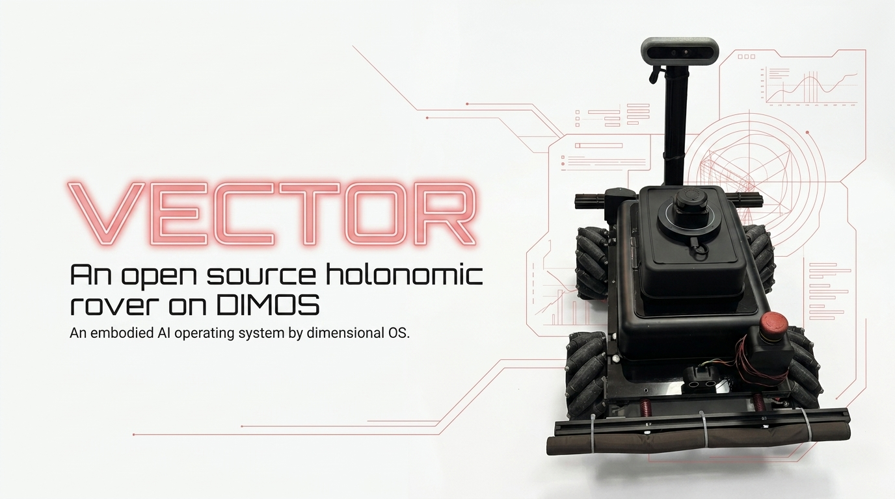
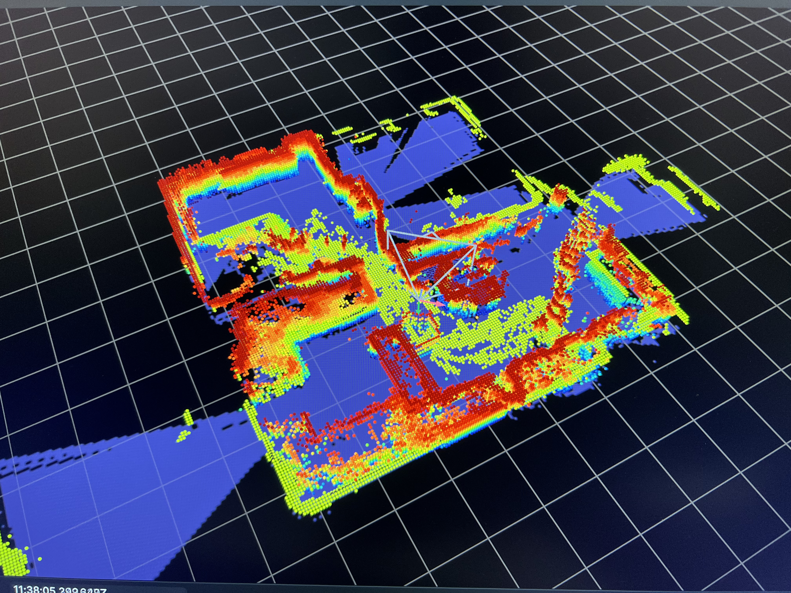
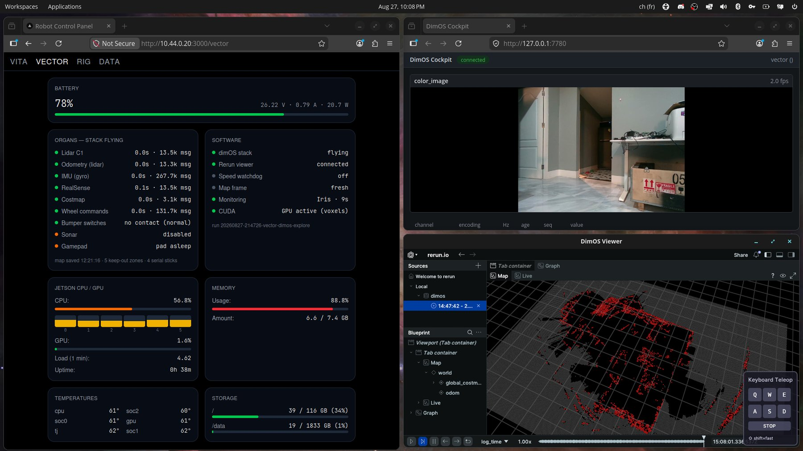
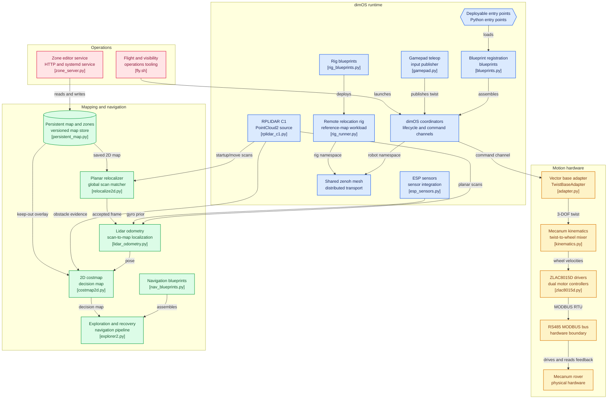

# vector-dimos



[VECTOR](docs/hardware.md) is a custom-designed holonomic mobile platform, built from
scratch: four mecanum wheels on brushless hub motors, a steel chassis, and enough
torque to carry a robot arm. It handles gravel, grass, tiles and ramps.


This package integrates VECTOR into [dimOS](https://github.com/dimensionalOS/dimos)
as an **external blueprint package** — no fork, no patches. dimOS discovers it
through Python entry points and composes our blueprints with its own.

## Status — work in progress



What runs today, all of it on a Jetson Orin Nano 8GB unless said otherwise:

- **Holonomic teleop** with a per-wheel envelope law — mixed stick inputs can
  never saturate a wheel — plus cold benches for every layer (kinematics,
  adapter, gamepad, lidar reader, blueprints).
- **Lidar odometry** (kiss-icp scan-to-map with a gyro prior) feeding a 2D
  costmap that learns and unlearns, with persistent maps and keep-out zones
  (documented below).
- **Voxel mapping on the GPU.** Stock aarch64 open3d has no CUDA, so this repo
  carries reproducible build recipes (`tools/four_open3d_cuda*.sh` — native on
  the Orin, cross via qemu, or on a rented cloud box) with every trap encoded:
  the nvcc `Pair()` patch, cmake pinned below 4, cudart linked shared so the
  wheel survives `dlopen` on JetPack 6.x, and the `GLIBC_TUNABLES` static-TLS
  dose the runtime needs. The resulting wheel puts dimOS's `VoxelBlockGrid`
  path on the GPU.
- **zenoh transport.** The same stack on dimOS's zenoh bus instead of LCM took
  the system load from ~24 to ~6.4 on the Nano.
- **Distributed relocalization.** dimOS's reference-map anchoring runs on a
  second machine over the same zenoh mesh (`vector-dimos.reloc-rig`, with a
  namespaced coordinator so both machines keep their own `dimos stop`). A match
  that costs 45–113 s on the Nano lands in 12–15 s there, and the merged
  reference map flows back to the stock costmapper on the robot.
- **Flight tooling**: a gated launch sequence (`tools/fly.sh` — piloted flight
  is the default, `EXPLORE=1` arms autonomy), a bi-bus organ panel
  (`tools/stats_server.py`, LCM and zenoh at once), and a state-transition
  vigil that only speaks on change.

This is the cockpit during a flight — every organ with its age and message
count on the left, the dimOS camera cockpit and the live map on the right.
The launch sequence refuses to fly until all three are actually on screen:



Where it stops today: the anchored lap — driving the flat against a saved
reference map and confirming the map comes out as one room, not two — is wired
end to end and verified on the bus, but the validation lap itself hasn't been
driven yet. Next after that: the gyro prior recalibration on the new mast, and
a JetPack 7.2 / CUDA 13 rebuild of the wheel.

## How it plugs in

- `VectorBaseAdapter` implements the dimOS `TwistBaseAdapter` protocol (holonomic,
  3 DOF: `[vx, vy, wz]`) on top of two ZLAC8015D dual-channel drivers spoken to
  over MODBUS RTU (RS485).
- `vector_dimos.blueprints` registers the adapter under the name `"vector"` in the
  dimOS twist-base adapter registry at import time — and deploys a
  `ControlCoordinator` subclass so that the same registration happens inside the
  forkserver worker where dimOS actually builds the adapter. Registering in the CLI
  process alone is not enough; that subclass is load-bearing and
  `vector_dimos/blueprints.py` explains why.
- Blueprints are exposed through the `dimos.blueprints` entry-point group, so the
  dimOS CLI sees them natively:

```console
$ dimos run vector-dimos.base vector-dimos.gamepad
```

| Blueprint | What it does |
|---|---|
| `vector-dimos.base` | ControlCoordinator driving the mecanum base through `VectorBaseAdapter` (velocity task on `cmd_vel`) |
| `vector-dimos.gamepad` | Gamepad teleop (pygame joystick) publishing holonomic twists on `tele_cmd_vel` |
| `vector-dimos.rplidar` | RPLIDAR C1 published as a flat `PointCloud2`, ready for the dimOS costmap / A* stack |

Perception composes with the stock dimOS `real-sense-camera` module (a RealSense
D455F sits on VECTOR's mast). Localization doctrine — why wheel odometry is never
the reference on mecanum, and how the point cloud and the lidar split the job —
is in [docs/localization.md](docs/localization.md).

## Architecture



## Install

```console
$ pip install -e .
```

The drive core (kinematics, ZLAC8015D driver, adapter) imports nothing but the
standard library, so its cold benches run on a bare checkout: `pymodbus` is
imported only when a real serial bus is opened, and `numpy` only by the lidar
module. Both are declared as dependencies, so `pip install -e .` pulls them in
anyway. For the dimOS runtime, install dimOS **from git main**: the
external-blueprints mechanism is newer than the current PyPI release.

```console
$ pip install -e ".[gamepad]"            # pygame teleop (the RPLIDAR C1 reader needs only pyserial)
$ pip install git+https://github.com/dimensionalOS/dimos.git
```

On the robot itself — a Jetson Orin Nano Super on JetPack 6.2 — the install has
its own quirks (Python 3.12 in a `uv` venv, a UI-less dimOS build for a headless
board, which serial port is free, which aarch64 wheels work). They are written
down in [docs/jetson_orin_nano.md](docs/jetson_orin_nano.md).

## Cold benches

Everything below runs without the robot, on a mocked MODBUS bus:

```console
$ python tests/test_kinematics.py          # inverse/forward mecanum, roundtrip identity
$ python tests/test_adapter_cold.py        # known twist -> known per-wheel RPM (real wheel
                                           # topology and signs), odometry roundtrip
$ python tests/test_adapter_bus_faults.py  # silent drive refused, dying bus never raises,
                                           # odometry freezes instead of dead-reckoning,
                                           # one bus poll per tick, one-sided outage
$ python tests/test_gamepad_cold.py        # known axis values -> known twists, pad hot-plug
$ python tests/test_rplidar_cold.py        # polar -> metres, sensor hot-plug and retry
$ python tests/test_blueprints_cold.py     # the three blueprints resolve through dimOS
```

The same mock bus carries the real dimOS runtime: with `VECTOR_MOCK_BUS=1` the
adapter binds to the in-memory MODBUS mock instead of opening the serial port,
so the pipeline — coordinator, control ticks, twist to per-wheel RPM, feedback,
odometry — is exercised with no motors on the bus. Plumbing only, never motion.

```console
$ VECTOR_MOCK_BUS=1 dimos run vector-dimos.base --no-local-relay --daemon
$ python tests/publish_twist.py --vx 0.37 --vy -0.21 --wz 0.83
$ dimos log -n 20
```

`publish_twist.py` publishes a `Twist` on `/cmd_vel` from a separate process and
prints the per-wheel RPM the geometry says that twist must produce. That is the
channel the base blueprint remaps the coordinator's `twist_command` onto —
dimOS normalizes the leading slash (`transport_topic()`), so `cmd_vel` and
`/cmd_vel` are the same channel, and `dimos topic send /cmd_vel` reaches it too.
The adapter logs what it actually commanded, so the claim and the result read
side by side:

```
expected wheel RPM  FL=+33 FR=+51 BL=-15 BR=+98
VECTOR base MOCK: twist vx=+0.370 vy=-0.210 wz=+0.830 -> wheel RPM FL=+33 FR=+51 BL=-15 BR=+98
```

Mind the watchdog: dimOS's `JointVelocityTask` drops the command to zero after
~0.2 s without a fresh twist, so whatever drives this base has to keep publishing.
The script does, at 20 Hz.

With no `VECTOR_MOCK_BUS` and nothing wired on the bus, the same command refuses to
start rather than driving blind — `ZLAC8015D id 2 (front) did not answer on
/dev/ttyTHS1 @115200`, then dimOS's `Failed to connect to vector adapter`, exit 1.
`python tests/probe_rs485.py` answers the same question on its own: it is a
read-only MODBUS probe (it writes nothing, so it is safe with the motors
powered) that says whether a driver is talking on the port at all.

What that run does and does not do yet on the robot itself is recorded in
[docs/jetson_orin_nano.md](docs/jetson_orin_nano.md).

## The map as a persistent asset

Until 2026-08-26 every restart of the stack birthed an amnesiac map with a
fresh arbitrary origin. Three things followed: hand-carrying the rover
corrupted the map (the new room scan-matched against a stale memory, and the
walls came out offset), keep-out zones could not exist because there was no
stable frame to draw them in, and every session rebuilt the flat from nothing.

Now the map is a file the rover comes back to.

```
~/.local/state/vector/persistent_map.npz          the flat
~/.local/state/vector/persistent_map.<stamp>.npz  the 5 previous generations
~/.local/state/vector/keepout.json                the zones drawn on it
```

At boot, `lidar_odometry` matches its first revolutions against that map
(`vector_dimos/relocalize2d.py`: multi-resolution correlative scan matching in
numpy — dimOS's own relocalization brick is FPFH+RANSAC on 3D clouds and needs
50 000 points with real normals, which a 400-point planar scan cannot give).
On acceptance it sets the odometry origin, so the continued map shares the
saved frame; on rejection the run starts fresh exactly as before, with the
score numbers in the log. Nothing is written to the map while the search runs.
The same search re-runs when the body is moved without the wheels.

Measured on two runs of the flat (`tools/reloc_proof.py`): a scan whose answer
is known lands 3.0 cm and 0.16 deg off, score 0.985, walls overlapping to
0.0 cm; a scan of a room the map has never seen is refused at score 0.473.

### Zones

A zone is a place the rover must treat differently, in metres, in the persistent
frame. `forbidden` cells become occupied AFTER every costmap layer, so no lidar
ray, no camera floor sample and no `body_clear` can erase them.
`no_slip_reflex` marks a place where the wheels are MEANT to slip (a ramp): the
rover may go there, but `stuck_guard` and `ImuSlipDetector` stay quiet inside
it instead of cutting the torque mid-climb. Zones apply only to a run that
relocalized into the persistent frame, and the log says so when they do not.
An edit is picked up within about half a minute — no restart.

A zone is a **rectangle** (`x0/y0/x1/y1`) or a **polygon** (`points`, at least 3
vertices). The polygons exist because the house sits 5.75 deg off the map axes:
every axis-aligned fence drawn around it either ate a corridor or leaked a
corner. Both shapes are read by the same code — `persistent_map.keepout_mask`
rasterises them (even-odd ray casting on the cell centres, plus the outline, so
a zone always rounds outward and a zone thinner than a cell still forbids one),
`persistent_map.point_in_zone` answers the guards, and the Rerun overlay draws
both.

Drawn with the mouse, on the map the rover actually uses — **http://192.168.0.56:8902**
(`tools/zone_server.py`, installed as `vector-zones.service`): the persistent map
is rendered as a picture, a click puts down a vertex, a double-click closes the
shape, and it is saved into the same `keepout.json`. The page reads and writes
those two files and nothing else — no serial port, no motor, no dimOS stack.

Typed, for a rectangle:

```console
$ python tools/keepout.py list
$ python tools/keepout.py add toilettes 0.55 -9.95 2.65 -6.65
$ python tools/keepout.py add rampe -3.0 -8.2 -1.95 -7.75 --type no_slip_reflex
$ python tools/keepout.py rm toilettes            # works on polygons too
```

`PERSISTENT_MAP=0` turns the whole thing off: no relocalization, no saved map,
no zones. `PERSISTENT_MAP_REBASE=1` lets a run that did NOT relocalize replace
the saved flat (off by default: it would move the flat under the zones).

```console
$ python tests/test_relocalization_cold.py   # 73 checks: known pose in, known pose out
$ python tests/test_zones_cold.py            # polygons: exact cell sets, the pose test,
                                             # the map picture, the atomic save
```

### The two maps in Rerun

The viewer shows two different things, and every failure lives in the gap
between them.

`world/global_map` is the pretty one: the accumulating voxel cloud, coloured by
height. It is a picture of the flat and nothing reads it.

`world/global_costmap` is the one the rover obeys — the 2D decision map, flat on
the floor, under the cloud. Three layers, each switchable in the tree:

| entity | colour | means |
|---|---|---|
| `world/global_costmap/obstacle` | red | lethal: the planner will not enter |
| `world/global_costmap/keepout`  | orange, labelled | lethal because a zone says so (a rectangle is one slab, a polygon one per row of cells) |
| `world/global_costmap/unknown`  | dark grey | never observed |

Free space is drawn as nothing at all — where the floor shows through, the rover
believes it can drive. A wall standing in the cloud with no red under it is a
wall the rover does not know about; red with nothing above it is a memory the
lidar no longer confirms. `unknown` is the biggest layer by far (tens of
thousands of cells): hide it first if the viewer gets heavy.

## Layout

```
vector_dimos/
  kinematics.py    # X-config mecanum inverse/forward kinematics + real wheel topology
  zlac8015d.py     # minimal ZLAC8015D MODBUS RTU driver (velocity mode)
  adapter.py       # VectorBaseAdapter: dimOS TwistBaseAdapter over the two drivers
  blueprints.py    # base / gamepad / rplidar blueprint definitions
  gamepad.py       # pygame joystick -> Twist module
  rplidar_c1.py    # RPLIDAR C1 -> flat PointCloud2 module
  wheel_odom.py    # optional standalone Odometry stream — no blueprint deploys it
                   # (the base blueprint already gets odometry from the adapter)
  mock.py          # mock MODBUS client for the cold benches
  lidar_odometry.py  # kiss-icp scan-to-map + the frame the map lives in (relocalization)
  costmap2d.py       # the 2D map that learns and unlearns (a cell the camera just called
                     # an obstacle ignores floor samples for 3 s), checkpoints, keep-out cells
  relocalize2d.py    # global 2D relocalization: a scan back onto a saved map (numpy only)
  persistent_map.py  # the saved map, its generations, and the zone file
  nav_blueprints.py  # the full nav/explore blueprints (voxel mapper on CUDA, costmapper, recorder)
  relocalization.py  # dimOS's RelocalizationModule with one threshold adapted to planar maps
  rig_blueprints.py  # import-light blueprints meant to run on a second machine (reloc-rig)
  memory.py          # recorder configs: full replay vs a light odom+costmap teleop recording
tools/
  fly.sh           # the gated launch sequence (piloted default; EXPLORE=1 arms autonomy)
  stats_server.py  # bi-bus organ panel (LCM + zenoh), JSON + /panel
  vigie_iris.py    # state-transition vigil over the panel: one line per real change
  rig_runner.py    # run dimos on a second machine with a namespaced coordinator
  zenoh_rendezvous.py   # a pure introduction peer so both machines' sessions gossip
  four_open3d_cuda.sh          # open3d CUDA bake, native on the Orin
  four_open3d_cuda_rig.sh      # same bake, cross via qemu in l4t-jetpack
  four_open3d_cuda_vast.sh     # same bake, on a rented aarch64 cloud box
  keepout.py       # declare the zones, in metres, in the persistent frame (CLI)
  zone_server.py   # the same zones, drawn with the mouse on the map: http://<rover>:8902
  zone_ui.html     # the page it serves (vanilla canvas, no CDN, no build step)
  vector-zones.service  # the systemd unit that keeps that page up on the Jetson
  reloc_proof.py   # prove the relocalizer on recorded runs, in centimetres
docs/
  hardware.md            # what VECTOR is made of
  localization.md        # the localization doctrine
  jetson_orin_nano.md    # dimOS bring-up notes for the Jetson (JetPack 6.2)
```

## Credits

- First version of the robot code by Sam.
- [dimOS](https://github.com/dimensionalOS/dimos) by Dimensional, Apache-2.0.
- License: Apache-2.0.
