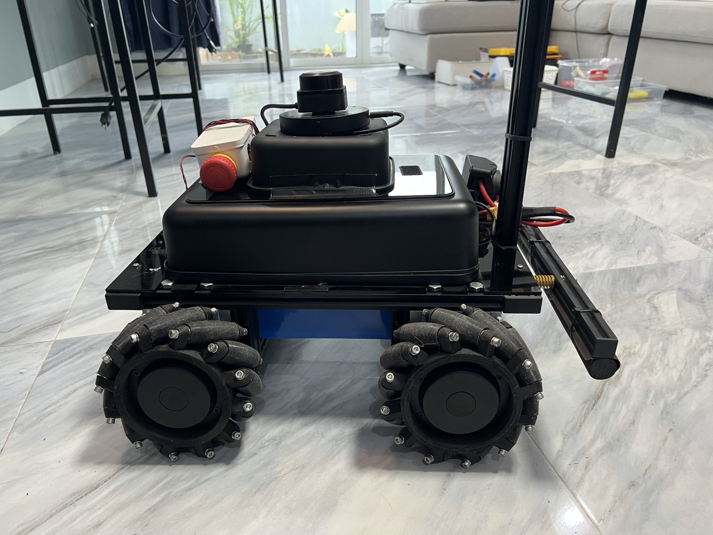

# vector-dimos



[VECTOR](docs/hardware.md) is a custom-designed holonomic mobile platform, built from
scratch: four mecanum wheels on brushless hub motors, a steel chassis, and enough
torque to carry a robot arm. It handles gravel, grass, tiles and ramps.


This package integrates VECTOR into [dimOS](https://github.com/dimensionalOS/dimos)
as an **external blueprint package** — no fork, no patches. dimOS discovers it
through Python entry points and composes our blueprints with its own.

## How it plugs in

- `VectorBaseAdapter` implements the dimOS `TwistBaseAdapter` protocol (holonomic,
  3 DOF: `[vx, vy, wz]`) on top of two ZLAC8015D dual-channel drivers spoken to
  over MODBUS RTU (RS485).
- `vector_dimos.blueprints` registers the adapter under the name `"vector"` in the
  dimOS twist-base adapter registry at import time — and deploys a
  `ControlCoordinator` subclass so that the same registration happens inside the
  forkserver worker where dimOS actually builds the adapter. Registering in the CLI
  process alone is not enough; that subclass is load-bearing and
  `vector_dimos/blueprints.py` explains why.
- Blueprints are exposed through the `dimos.blueprints` entry-point group, so the
  dimOS CLI sees them natively:

```console
$ dimos run vector-dimos.base vector-dimos.gamepad
```

| Blueprint | What it does |
|---|---|
| `vector-dimos.base` | ControlCoordinator driving the mecanum base through `VectorBaseAdapter` (velocity task on `cmd_vel`) |
| `vector-dimos.gamepad` | Gamepad teleop (pygame joystick) publishing holonomic twists on `tele_cmd_vel` |
| `vector-dimos.rplidar` | RPLIDAR C1 published as a flat `PointCloud2`, ready for the dimOS costmap / A* stack |

Perception composes with the stock dimOS `real-sense-camera` module (a RealSense
D455F sits on VECTOR's mast). Localization doctrine — why wheel odometry is never
the reference on mecanum, and how the point cloud and the lidar split the job —
is in [docs/localization.md](docs/localization.md).

## Install

```console
$ pip install -e .
```

The drive core (kinematics, ZLAC8015D driver, adapter) imports nothing but the
standard library, so its cold benches run on a bare checkout: `pymodbus` is
imported only when a real serial bus is opened, and `numpy` only by the lidar
module. Both are declared as dependencies, so `pip install -e .` pulls them in
anyway. For the dimOS runtime, install dimOS **from git main**: the
external-blueprints mechanism is newer than the current PyPI release.

```console
$ pip install -e ".[gamepad]"            # pygame teleop (the RPLIDAR C1 reader needs only pyserial)
$ pip install git+https://github.com/dimensionalOS/dimos.git
```

On the robot itself — a Jetson Orin Nano Super on JetPack 6.2 — the install has
its own quirks (Python 3.12 in a `uv` venv, a UI-less dimOS build for a headless
board, which serial port is free, which aarch64 wheels work). They are written
down in [docs/jetson_orin_nano.md](docs/jetson_orin_nano.md).

## Cold benches

Everything below runs without the robot, on a mocked MODBUS bus:

```console
$ python tests/test_kinematics.py          # inverse/forward mecanum, roundtrip identity
$ python tests/test_adapter_cold.py        # known twist -> known per-wheel RPM (real wheel
                                           # topology and signs), odometry roundtrip
$ python tests/test_adapter_bus_faults.py  # silent drive refused, dying bus never raises,
                                           # odometry freezes instead of dead-reckoning,
                                           # one bus poll per tick, one-sided outage
$ python tests/test_gamepad_cold.py        # known axis values -> known twists, pad hot-plug
$ python tests/test_rplidar_cold.py        # polar -> metres, sensor hot-plug and retry
$ python tests/test_blueprints_cold.py     # the three blueprints resolve through dimOS
```

The same mock bus carries the real dimOS runtime: with `VECTOR_MOCK_BUS=1` the
adapter binds to the in-memory MODBUS mock instead of opening the serial port,
so the pipeline — coordinator, control ticks, twist to per-wheel RPM, feedback,
odometry — is exercised with no motors on the bus. Plumbing only, never motion.

```console
$ VECTOR_MOCK_BUS=1 dimos run vector-dimos.base --no-local-relay --daemon
$ python tests/publish_twist.py --vx 0.37 --vy -0.21 --wz 0.83
$ dimos log -n 20
```

`publish_twist.py` publishes a `Twist` on `/cmd_vel` from a separate process and
prints the per-wheel RPM the geometry says that twist must produce. That is the
channel the base blueprint remaps the coordinator's `twist_command` onto —
dimOS normalizes the leading slash (`transport_topic()`), so `cmd_vel` and
`/cmd_vel` are the same channel, and `dimos topic send /cmd_vel` reaches it too.
The adapter logs what it actually commanded, so the claim and the result read
side by side:

```
expected wheel RPM  FL=+33 FR=+51 BL=-15 BR=+98
VECTOR base MOCK: twist vx=+0.370 vy=-0.210 wz=+0.830 -> wheel RPM FL=+33 FR=+51 BL=-15 BR=+98
```

Mind the watchdog: dimOS's `JointVelocityTask` drops the command to zero after
~0.2 s without a fresh twist, so whatever drives this base has to keep publishing.
The script does, at 20 Hz.

With no `VECTOR_MOCK_BUS` and nothing wired on the bus, the same command refuses to
start rather than driving blind — `ZLAC8015D id 2 (front) did not answer on
/dev/ttyTHS1 @115200`, then dimOS's `Failed to connect to vector adapter`, exit 1.
`python tests/probe_rs485.py` answers the same question on its own: it is a
read-only MODBUS probe (it writes nothing, so it is safe with the motors
powered) that says whether a driver is talking on the port at all.

What that run does and does not do yet on the robot itself is recorded in
[docs/jetson_orin_nano.md](docs/jetson_orin_nano.md).

## The map as a persistent asset

Until 2026-08-26 every restart of the stack birthed an amnesiac map with a
fresh arbitrary origin. Three things followed: hand-carrying the rover
corrupted the map (the new room scan-matched against a stale memory, and the
walls came out offset), keep-out zones could not exist because there was no
stable frame to draw them in, and every session rebuilt the flat from nothing.

Now the map is a file the rover comes back to.

```
~/.local/state/vector/persistent_map.npz          the flat
~/.local/state/vector/persistent_map.<stamp>.npz  the 5 previous generations
~/.local/state/vector/keepout.json                the zones drawn on it
```

At boot, `lidar_odometry` matches its first revolutions against that map
(`vector_dimos/relocalize2d.py`: multi-resolution correlative scan matching in
numpy — dimOS's own relocalization brick is FPFH+RANSAC on 3D clouds and needs
50 000 points with real normals, which a 400-point planar scan cannot give).
On acceptance it sets the odometry origin, so the continued map shares the
saved frame; on rejection the run starts fresh exactly as before, with the
score numbers in the log. Nothing is written to the map while the search runs.
The same search re-runs when the body is moved without the wheels.

Measured on two runs of the flat (`tools/reloc_proof.py`): a scan whose answer
is known lands 3.0 cm and 0.16 deg off, score 0.985, walls overlapping to
0.0 cm; a scan of a room the map has never seen is refused at score 0.473.

### Zones

```console
$ python tools/keepout.py list
$ python tools/keepout.py add toilettes 0.55 -9.95 2.65 -6.65
$ python tools/keepout.py add rampe -3.0 -8.2 -1.95 -7.75 --type no_slip_reflex
$ python tools/keepout.py rm toilettes
```

Coordinates are metres in the persistent frame — read them off the Rerun map by
hovering it. `forbidden` cells become occupied AFTER every costmap layer, so no
lidar ray, no camera floor sample and no `body_clear` can erase them.
`no_slip_reflex` marks a place where the wheels are MEANT to slip (a ramp): the
rover may go there, but `stuck_guard` and `ImuSlipDetector` stay quiet inside
it instead of cutting the torque mid-climb. Zones apply only to a run that
relocalized into the persistent frame, and the log says so when they do not.
An edit is picked up within about half a minute — no restart.

`PERSISTENT_MAP=0` turns the whole thing off: no relocalization, no saved map,
no zones. `PERSISTENT_MAP_REBASE=1` lets a run that did NOT relocalize replace
the saved flat (off by default: it would move the flat under the zones).

```console
$ python tests/test_relocalization_cold.py   # 73 checks: known pose in, known pose out
```

## Layout

```
vector_dimos/
  kinematics.py    # X-config mecanum inverse/forward kinematics + real wheel topology
  zlac8015d.py     # minimal ZLAC8015D MODBUS RTU driver (velocity mode)
  adapter.py       # VectorBaseAdapter: dimOS TwistBaseAdapter over the two drivers
  blueprints.py    # base / gamepad / rplidar blueprint definitions
  gamepad.py       # pygame joystick -> Twist module
  rplidar_c1.py    # RPLIDAR C1 -> flat PointCloud2 module
  wheel_odom.py    # optional standalone Odometry stream — no blueprint deploys it
                   # (the base blueprint already gets odometry from the adapter)
  mock.py          # mock MODBUS client for the cold benches
  lidar_odometry.py  # kiss-icp scan-to-map + the frame the map lives in (relocalization)
  costmap2d.py       # the 2D map that learns and unlearns, checkpoints, keep-out cells
  relocalize2d.py    # global 2D relocalization: a scan back onto a saved map (numpy only)
  persistent_map.py  # the saved map, its generations, and the zone file
  stuck_guard.py     # wheels turn, world does not -> slip (quiet inside a no_slip_reflex zone)
  imu_slip.py        # the body as witness: slip in 0.2-0.5 s (same zone rule)
tools/
  keepout.py       # declare the zones, in metres, in the persistent frame
  reloc_proof.py   # prove the relocalizer on recorded runs, in centimetres
docs/
  hardware.md            # what VECTOR is made of
  localization.md        # the localization doctrine
  jetson_orin_nano.md    # dimOS bring-up notes for the Jetson (JetPack 6.2)
```

## Credits

- First version of the robot code by Sam.
- [dimOS](https://github.com/dimensionalOS/dimos) by Dimensional, Apache-2.0.
- License: Apache-2.0.
