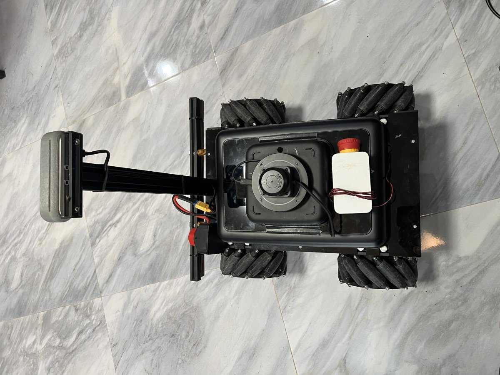

# VECTOR hardware

Custom design, built from scratch. One-off — this repo is its software.

## Drive

| Component | Details |
|---|---|
| Wheels | 4× mecanum (X configuration) on brushless hub motors |
| Motor drivers | 2× ZLAC8015D dual-channel AC servo drivers |
| Driver bus | MODBUS RTU over RS485, 115200 baud 8N1 — unit 2 = front pair, unit 1 = back pair |
| Compute | NVIDIA Jetson Orin Nano Super (JetPack 6.2) — bring-up notes: [jetson_orin_nano.md](jetson_orin_nano.md) |
| RS485 interface | Waveshare RS485/CAN HAT on the Jetson's 40-pin header — the bus is `/dev/ttyTHS1` (the header UART; the login console is elsewhere, nothing to disable) |

Wheel topology (as wired, encoded in `kinematics.py` and verified by the cold
bench): each driver's left channel is inverted — a negative RPM command drives
the left wheels forward.

## Perception

| Component | Details |
|---|---|
| Depth camera | Intel RealSense D455F, mounted on a mast (drives the primary point cloud), USB |
| Lidar | Slamtec RPLIDAR C1 (360° 2D), published as a flat `PointCloud2` |
| Lidar interface | CP2102 USB-UART adapter, 460800 baud — 4 wires: GND, 5 V, TX, RX. The C1's RX is 3.3 V logic |
| IMU | The one inside the D455F — no separate IMU on the platform |
| Wheels | 4 mecanum wheels, **17 cm diameter measured** (0.085 m radius, the number `kinematics.py` runs on) |

## Power

| Component | Details |
|---|---|
| Battery | LiFePO4 24 V 30 Ah |
| BMS | 8S 60 A |
| Charger | 29.2 V 20 A |
| Protection | General disconnect, per-driver breakers, 100 A main fuse |
| Metering | PZEM-017 shunt meter (100 A) — shares the RS485 bus with the drivers |

## Geometry

Values used by `kinematics.py`:

- Wheel radius: 0.085 m — the built mecanum wheel measured on the chassis
  (2026-08-22): 17 cm diameter, roller tips included. The first robot code
  carried two other numbers and both are wrong for this wheel: 0.0635 m (the
  bare 5" tire before the mecanum was built around it) and 0.105 m (a dead
  `R_Wheel` constant that never fed the mecanum path). This package shipped
  0.105 until 2026-08-22 and overestimated odometry by ~24 %. Radius scales
  odometry linearly, so 0.085 still has to be confirmed by an odometry
  roundtrip on the real chassis (drive a known distance, compare `/odom`).
- Half wheelbase: 0.15 m
- Half track: 0.20 m
- Kinematic constant K (half wheelbase + half track): 0.35 m
